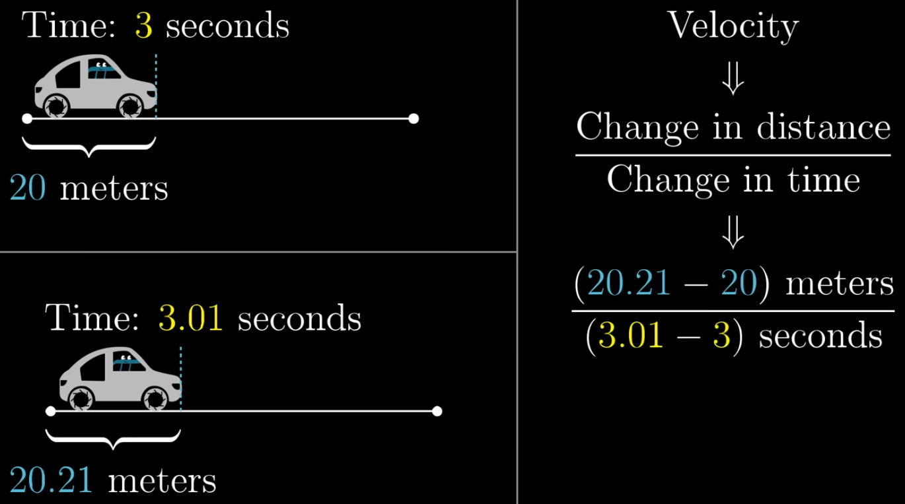
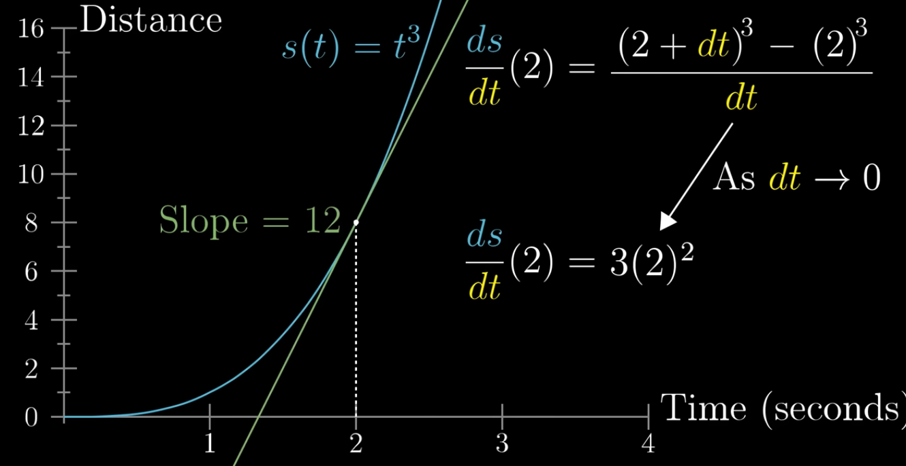
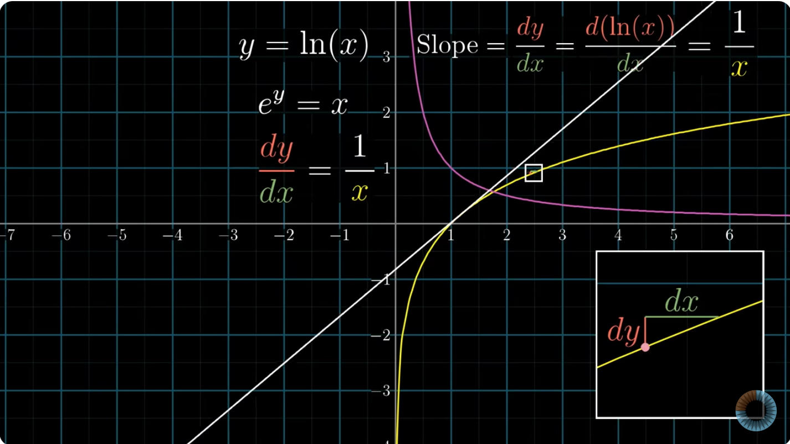

# Essence of calculus

## 1 The essence of calculus

**"The art of doing mathematics is finding that special case that contains all the germs of generality." --- David Hilbert**

### 1.1 The Beginning Story

The story starts more simply, just you and a circle, let's say with radius 3. You're trying to figure out its area, and after going through a lof of paper trying different ways to chop up and rearrange the piecies of that area.

Many of which might lead to their own interesting observations, maybe you try out the idea of slicing up the circle into many concentric rings. These should seem promising because it resprects the symmetry of the circle, and math has a tendency to reward you when you respect its symmetries.

Let's take one of those rings, which has some inner radius $r$ that's between $0$ and $3$.

If we can find a nice expression for the area of each ring like this one, and if we have a nice way to add them all up, it might lead us to an understanding of the full circle's area.

Maybe you start by imagining straightening out this ring. And you could try thinking through exactly what this new shape is and what its area should be, but for simplicity, leet's just approximate it as a rectangle.

The width of that rectangle is the circumference of the original ring, which is $2\pi r$. Then the thickness? Well, that depends on how finely you chopped up the circule in the first place, which was kind of arbitrary.

### 1.2 The Small Chop $dr$

In the sprit of using what will come to be standard calculus notation, let's call that thickness $dr$ for a tiny difference in the radius from one ring to the next. Maybe you thinnk of it as something like 0.1.

So approximating this unwrapped ring as a thin rectangle, its area is $2\pi r$ => $2\pi rdr$ -> the little thickness. And even though that's not perfect, for smaller and smaller choices of $dr$, this is actually going to be a better and better approximation for that area.

Since the top and the bottom of this shape are going to get closer and closer to being exactly the same length. So let's just move forward with the approximation.

Keeping in the back of our minds that it's slightly wrong, but it's going to become **more accurate for smaller and smaller choices of $dr$**. That is, if we slice up the circle into thinner and thinner rings.

So just to sum up where we are, you've broken up the area of the circle into all of these rings, and you're approximating the area of each one of those as $2\pi rdr$, where the specific value for that inner radius ranges from $0$ for the smallest ring up to just under $3$ for the biggest ring, spaced out by whatever the thinkness is that you choose for $dr$, something like 0.1.

And notice that the spacing between the values here corresponds to the thickness $dr$ of each ring, the difference in radius from one ring to the next.

### 1.3 The Rectangles Approximation

In fact, a nice way to think about the rectangles approximating each ring's area is to fit them all upright side by side along this axis. Each one has a thickness $dr$, which is why they fit so snugly right there together, and the height of any one of these rectangles sitting above some specific value of $r$, like 0.6, is exactly $2\pi$ times that value $r$.

That's the circumference of the corresponding ring that this rectangle approximates.

Each of these rectangles ony approximates the area of the corresponding ring from the circle. For smaller and smaller choices of $dr$, you might at first think that turns the problem into a monstrously large sum. I mean, there's many many rectangles to consider, and the decimal precision of each one of their areas is going to be an absolute nightmare.

But notice, all of their areas in aggregate just looks like the area under a graph. and that portion under the graph is just a triangle, a triangle with a base of 3 and a height of that's $2\pi * 3$.

#### 

Or if the radius of our original circle was some other value **$R$**, that area comes out to be $\pi R^{2}$.

But if you want to think like a mathematician here, you don't just care about finding the answer, you care about developing general problem-solving tools and techniques.

### 1.4 The Hard Problem

You had this **hard problem** that could be approximated with the sum of many **small numbers/values**, each of wich looked like $2\pi dr$, for values of $r$ ranging between $0$ and $3$.

Remember, the small number $dr$ here represents our choice for the thickness of each ring, and there are two important thing to note about **$dr$**.

first of all, not only is $dr$ a factor in the quantities we're adding up $2\pi dr$, it also gives the spacing between the different values of $r$.

Secondly, the smaller our choice for dr, the better the approximation. Adding all of those numbers could be seen in a different pretty clever way as adding the areas of many thin rectangles sitting underneath a graph, the graph of the function $2\pi r$ in [this case](#calculus_8png).

Then, this is key, by considering smaller and smaller choices for $dr$, corresponding to better and better approximations of the original problem, the sum, thought of as the aggregate area of those rectangles, approaches the **area under the graph**.

Because of that, you can conclude that the answer to the original question, is full unapproximated precision, is exactly the same as the area underneath thi graph.

A lot of other hard problems in math and science can be broken down and approximated as the sum of many small quantities, things like figuring out how far a car traveled based on its velocity at each point in time.

In a case like that, you might range through many differnet points in time, and at each one multiply the velocity at that time times a tiny change in time, $dt$, which would give the corresponding little bit of distance traveled during that little time.

If finer and finer approximations of the original problem corresponding to thinner and thinner rings, then the original problem is equivalent to finding the area under some graph.

The point now is that you, as the mathematician having just solved a problem by reframing it as the area under a graph, might start thinking about how to find the areas under other graphs.

### 1.5 What If Other Scenarios

We were lucky in the circle problem that the relevant area turned out to be a triangle, but imagine instead something like a parabola, the graph of $x^{2}$.

We'll fix that left endpoint in place at 0, and let the right endpoint vary. Are you able to find a funciton, $A(x)$, that gives you the area under this parabola between 0 and x?

A functiion $A(x)$ likes this is called an integral of $x^{2}$. Calculus holds within it the tools to figure out what an integral like this is. We know it gives the area under the graph of $x^{2}$ between some fixed left point and some variable right point, but we don't know what it is.

This relationship between tiny changes to the mystery function and the values of $x^{2}$ itself is true at all inputs, not just 3. And any funciton defined as the area under some graph has this property.

Here, we're stumbling into another big idea from calculus -> derivatives.

## 2 The paradox of the derivative

**"So far as te theories of mathematics are about reality, they are not certain: so far as they are certain, they are not about reality." --- Albert Einstein**

### 2.1 Goals

1. Learn derivatives

- It's actaully a very subtle idea: The things is though, there's some subtlety to this topic, and a lot of potential for paradoxes if you're not careful.

2. Avoid paradox

- It's common for people to say tha the deivative measures an instantaneous rate of change, but when you think about it, that phrase is actually an oxymoron.
- Chane is something that happens between separate points in time, when you blind yourself to all but just a singe instant, there is not really any room for change.

### 2.2 Understand the Challenge of Calculus Fathers

The instantaneous rate of change is actually nonsense, it makes you appreciate just how clear the father of calculus were in capturing the idea that phrase is meant to evoke, but with a perfectly sensible piece of math, the derivative.

If we were to plot the car's velocity in meters per second as a function of time $v(t)$, it might look like this bump.

These two curves are definitely related to each other. If you change the specific distance vs fime function, you'll have some different velocity vs time function.

Exactly how does velocity depend on a distance vs time function? -> Think critically about what velocity means.

Be ware of that the velocity at a single moment makes no sense. If I show you a picture of a car, just a snapshot in an instant, and I ask you how fast it's going? You'd have no way of telling me.

What you'd need are two separate points in time to compare. That way you can compute whatever the change in distance acroos those times is, divided by the change in time.

That's what velocity is, it's the distance traveled per unit time. We want to associate individual points in time with a velocity, but actually computing velocity requires comparing two separate points in time

If that feels strange and paradoxical, good! You're grapping with the same conflicts that the fathers of calculus did. If you want a deep understanding for rates of change, not jsut for a moving car, but for all sorts of things in science, you're going to need to resolve this apparent paradox.

### 2.3 First, the Real World

Let's think about what the car's speedometer is probably doning.

Graphically, you can imagine zooming in on some point of this distance vs the time graph above $t = 3$. That $dt$ is a small step to the right, since time is on the horizontal axis, and that $ds$ is the resulting change in the height of the graph, since the vertical axis represents the distance traveled.

So $ds/dt$ is something you can think of as the rise over run slope between two very close point on this graph. We could apply this to any other point in time, so we consider this expression $ds/dt$ to be a function of t $f(t)$. Something where I can give you a tome $t$ and you can give me back the value of this ratio at that time, the velocity as a function of time.

This idea of $ds/dt$, a tiny change in the value of the funciton s divided by the tiny change in the input that caused it, that's almost what a derivative is.

Even though a car's speedometer will actually look at a concrete change in time, like 0.01 seconds, and even though the drawing program here is looking at an actual concrete change in time, in pure math the derivative is not this ratio $ds/dt$ for a specific choice of $dt$.

Instead, it's whatever that ratio approaches as your choice for $dt$ approaches 0. Luckily there is a really nice visual understanding for what it means to ask what this ratio approaches.

### 2.4 Second, the Mathematics

Remember, for any specific choice of $dt$, this ratio $ds/dt$ is the slope of a line passing through two separate points on the graph. As $dt$ approaches 0, and as those two points approach each other, the slope of the line approaches the slope of a line that's tangent to the graph at whatever point $t$ we're looking at.

So the true honest-to-goodness pure math derivative is not the rise over run slope between two nearby points on the graph, it's equal to the slope of a line tangent to the graph at a single point.

Notice that I am not saying that whatever happens when $dt$ is infinitely small, whatever that would mean. Nor am I saying that you plug in 0 for $dt$.

This $dt$ is always a finite small non-zero value, it's just that it approaches 0 is all.

It's healthiest for you to think of this slope not as some instantaneous rate of change, but instead as the **best constant approximation for a rate of change around the point**.

### 2.5 Using $d$ announces that $dt -> 0$

The convention in calculus is that whenever you're using the letter $d$ like $dt -> 0$, you're kind of announcing your intention that eventually you're going to see what happens as $dt$ approaches 0.

For example, the honest-to-goodness pure math derivative is written as $dt/dt$,
even though it's technically not a fraction per se.

But whatever that fraction approaches for smaller and smaller nudges in $t$.

### 2.6 An Eample

We could more generally say that the derivative of $t^{3}$ as a function of t is $3(t)^{2}$ => ${ds\over{dt}}(t) = 3(t)^2$.

Now take a step back, because that's beatiful. The derivative is this crazy complicated idea. We've got tiny changes in distance over tiny changes in time, but instead of looking at any specific one of those, we are talking about what that thing approaches.

In Practice, you wouldn't go through all this algebra each time. Knowing that the derivative of $t^{3} = 3t^{2}$ is one of those things that all calculus students learn how to do immediately without having to re-derive it each time.

### 2.7 "Instantaneous rate of change" -> Paradoxes

Think about the actual car traveling according to this $t^{3}$ distance function, and consider its motion at the moment $t=0$, right at the start. Now ask yourself whether or not the car is moving at that time.

On the one hand, we can compute its speed at that point using the derivative, which for time $t=0$ works out to be 0. Visually, this means that the tangent line to the graph at that point is perfectly flat, so that car's quote-unquote intantaneous velocity is 0, and that suggests that obviously it's not moving.

On the other hand, if it doesn't start moving at time 0, when does it start moving? Is the car moving at the time 0? Do you see the paradox? The issue is that the question makes no sense.

**At time $t=0$, is the car moving?**

It references the idea of change in a moment, but that doesn't actually exist. That's just not what the derivative measures.

What it means for the derivative of a distance function to be 0 is that the **best constant approximation** for the car's velocity around that point is **$0{m\over{s}}$**.

For example, if you look at an actual change in time, say between 0 and 0.1 seconds, the car does move. It moves 0.001m. That's very small, and importantly, it's very small compared to the change in time, giving an average speed of only $0.01{m\over{s}}$.

Remember, what it means for the derivatiive of this motion to be 0 is that for smaller and smaller nudges in time, this ratio of meters per second approaches 0.

But that's not to say tha the car is static. Approximating its movement with a constant velocity of 0 is, after all, just an **approximation**.

So whenever you hear people refer to th derivative as an instantaneous rate of change, a prhase which is intrinsically oxymoronic, I want you to think of that as a conceptural shorthand for the best constant approiimation for rate of change.

## 3 Derivative formulas through geometry

**"You know, for a mathematician, he did not have enough imagination</spn>. But he has become a poet and now he is fine." --- David Hilbert**

### 3.1 Start with $x^{2}$

What is the derivative of $x^{2}$? That is, if you were to look at some value x, and compare it to a value slightly bigger,just $dx$ bigger, what's the corresponding change in the value of the funciton --- $df$?

And in particular, what's $df/dx$, the rate at which this funciton is changing per unit change in $x$.

As a first step for intuition, we know that you can think of this ratio $df/dx$ as the slope of a tangent line to the graph of $x^{2}$, and from that you can see that the slope generally increases as x increases.

At zero, the tangent line is flat, and the slope is zero.

At $x = 1$, it's somehting a bit steeper. But looking at graphs isn't generally the best way to understand the precise formula for a derivative.

For that, it's best to take a more literal look at what $x^{2}$ actually means, and in this case, let's go ahead and picture a square whos side lenght is $x$.

If you increase $x$ by some tiny nugde, some little $dx$, what's the resulting change in the area of that square? That slight change in area is what $df$ means in the context. It's the tiny increase to the value of $f(x) = x^{2}$, caused by increasing $x$ by that tiny nudge $dx$.

Now you can see that there's 3 new bits of area i this diagram, two thin rectangles and a minuscule square.

- The two thin rectangles each have side lengths of $xdx$, so they account for $2xdx$ units of new area.
- The little square there has an area of $dx^{2}$, but you should think of that as being really tiny, negligibly tiny.
  - In principle, $dx$ should be thought of as a truly tiny amount, and for those truly tiny amounts, for these truly tiny amounts, a good rule of thumb is that you can ignore anything that includes a $dx$ raised a power greater than 1.
  - That is, a tiny change square is a negligible change.

**$df = 2xdx$ => ${df\over{dx}} = 2x$**

### 3.2 How about $x^{3}$

Each of those thin squares has a volume of $x^{2}dx$, the area of the face times that little thickness $dx$. So in total this gives us $3x^{2}dx$ of volume change.

And to be sure there are other slivers of volume here along the edges, and that tiny one in the corner left-up, but all of that volume is going to be proportional to $dx^{2}$, so we can safely ignore them.

What that means in terms of graphical intuition is that the slope of the graph of $x^{3}$ at every signle point $x$ is exactly $3x^{2}$.

Reasoning about that slope, it should make sense that in this derivative is high on the left and then $0$ at theo orgin and then high again as you move to the right.

### 3.3 Abstract the Rules

WHen you nudge that input $x$, increasing it slightly to $(x + dx)^{n}$, working out the exact value of that nudged output would involve multiplying togther these n separate $(x + dx)$ terms.

The full expansion would be really complicated, but part of the point of derivatives is that most of that complication can be ignored.

The first term in your expansion is $x^{n}$. This analogous to the area of the original square, or the volume of the original cube from our previous examples.

For the next terms in the expansion you can choose mostly $x$s with a single $dx$. Since there are n different parentheticals from which you could have chosen that single $dx$, this gives us a separate terms,

THis is analogous to how the majority of the new area in the square came from those two bars, each with area $x$ times $dx$, or how the bulk of the new values in the **cube**.

### 3.4 $f(x) = 1\over{x}$

Now on the hand you could just blindly try applying the power rule as $x^{-1} = -1x^{-2}$. Let's have some fun and see if we can reason about this geometrically, rather than just plugging it through some formula.

The value $1\over{x}$ is asking what number multiplied by x eqauls 1?

Imagine a little rectangle puddle of water sitting in two dimensions whose area is 1. Let's say that its width is x, whch means that the height has to be $1\over{x}$, since the total area of it is 1.

If you increased x up to 3, then the other side has to be squished down to $1\over{3}$.

If you think of this width x of the puddle as being in the xy-plane, then the corresponding output $1\over{x}$, the height of the graph above that point, is whatever the height of your puddle has to be maintain an areaa of 1.

So with this visual in mind, for the derivative, imagine nudging up that value of x by some tiny amount, some tiny $dx$. How must the height of this rectangle change so that the area of the puddle remains constant at 1?

That is, increasing the width by $dx$ adds some new area of the right here. So the puddle has to decrease in height by some $d({1\over{x}})$, so that the area lost off of that top cancels out the area gained.

### 3.5 $sin(\theta)$

## 4 Visualizing the chain rule and product rule

**"Using the chain rule is like peeling an onion: you have to deal with each layer at a time, and if it is too big you will start crying." --- (Anonymous professor)**

### 4.1 Sum: ${d\over{dx}}(sin(x) + x^{2})$

### 4.2 Product: ${d\over{dx}}(sin(x)x^{2})$

**Not the best visualization**

If you're dealing with a product of two things, it helps to understand it as some kind of area. In this case, maybe you try to configure some metal setup of a box where the side lengths are $sin(x)$ and $x^{2}$.

Since these are functions, you might think of those sides are adjustable, dependent on the value ofx, which maybe you think of as this number that you can just freely adjust up and down.

Focus on that top side who changes as the function of $sin(x)$. As you change this value of x up from 9, it increases up to a length of 1 as sine of x moves up towards its peak.

And after that it starts to decreas as $sin(x)$ comes down from 1. In the same way, that height there is always changing as $x^{2}$.

So $f(x)$, defined as the product of these functions, is the area of this box. The nedge $dx$ caused that width to change by some small $dsine(x)$, and it caused that height to change by some $dx^{2}$.

This gives us three little snippets of new area:

- A thin rectangle on the bottom whose area is its width - $sin(x)$ => $sin(x)d(x^{2})$
- A thin rectangle on the right whose area is its height $x^{2}$ => $x^{2}d(sin(x))$
- The little bit in the corner, but we can ignore that. Its area is ultimately proportional to $d(x^{2})$ that becomes negligibe as $dx$ goes to 0.

### 4.3 Composition: ${d\over{dx}}(sin(x^{2}))$

The cancellation of $dh$ is not just a notation trick! That is a genuine reflection of what's going on with the tiny nudges that underpin everything we do derivatives.

## 5 What's so special about Euler's number e?

**"Who has not been amazed to learn that the function $y = e^{x}$, like a phoenix rising again from its own ashes, is it own derivative?." --- (Anonymous professor)**

### 5.1 Deriving the key proportionality property

What you'll find is that for smaller and smaller choices of $dt$, this value approaches a very specific number, around 0.6931. The central point is that this is some kind of constant.

Unlike derivatives of other functions, all of the stuff that depends on $dt$ is separate from the value of $t$ itself. So the derivative of 2 to the t is just itself, but multiplied by some constant.

Evidently, the rate of change for this function over much smaller timescales, is not quite equal to itself, but it's proportional to itself, with this very peculiar proportionality constant of 0.6931.

There is not too much special about the number 2 here. If instead we had dealt with the function $3^{t}$, the exponential property would also have led us to the conclusion that the derivative of $3^{t}$ is proportional to itself, but this time it would have had a proportionality constant of 1.0986.

And for other bases to your exponent, you can have fun trying to see what the various proportionality constants are, maybe seeing if you can find a pattern in them.

Maybe, you would notice that this number happens to be exactly 3 times the constant associated with the base for 2. So these numbers certainly aren't random, there is some kind of pattern, but what is it? What does 2 have to do with the number of 0.6931, and what does 8 have to do with the number of 2.079?

### 5.2 What is $e$?

A second question that is ultimately going to explan these mystery constants is whether there's some base where that proportionality constant is 1, where the $d(a^{t})$ is not just proportional to itself, but actual equals to itself.

**There is! $e = 2.71828...$**

In fact, it's not just that the number $e$ happens to show up here, this is in a sense what defines the number $e$.

It's a liitle like asking why does $\pi$ of all numbers happen to be the ratio of the circumference of a circle to its diameter. This is at its heart what defines this value.

All exponential funtions are proportional to their own derivative, but $e$ alone is the special number so that proportionality constant is 1, meaning $e^{t}$ actually equals its own derivative.

Look at the graph of $e^{t}$, it has the peculiar property that the slope of a tangent line to any point on this graph equals the hight of that point above the horizontal axis.

### 5.3 Natural logs

The existence of a function like this answers the question of the mystery constants, and it's because it gvies different way to think about functions that are proportional to their own derivative. The key is the **chain rule**.

${d(e^{3tt})\over{dt}} = 3e^{3t}$

Either way, the point is ${d(e^{ct})\over{dt}} = ce^{ct}$, from here, the question of those mystery contants really just comes down to a certain algebraic manipulation.

The number 2 can also be written as e to the natural log of 2 ($2 = e^{ln(2)}$). There is nothing fancy here, this is the definition of the natural log, it ask the question:

So the function $2^{t}$ is the same as the function $e^{ln(2)t}$

From what we just saw, combining the fact that $e^{t}$ is its own derivative with the chain rule, the derivative of this function is proportional to itself, with a proportionality constant equal to the natural log of 2.

In fact, throughout applications of calculus, you rarely see exponentials written as some base to a power t. Instead, you almost always write the exponential as e to the power of some constant times t.

### 5.4 Writing $e^{ct}$ is a choice

There are many ways to write down any particular exponential function. And when you see something written as $e$ to some constant times $t$, that's a choice we make to write it that way, and the number $e$ is not fundamental to that functon itself.

What is special about writing exponentials in terms of $e$ like this is that it gives that constant in the exponent a nice readable meaning.

All sorts of natural phenomena involve some rate of change that's proportional to the thing that's changing. For example, the rate of growth of a population actually does tend to be proportional to the size of the population itself, assuming there isn't some limited resource slowing things down.

If you put a cup of hot water in a cool room, the rate at which the water cools is proportional to the difference in temperature between the room and the water, or said a little differently, the rate at which that difference changes is proportional to itself.

If you invest your money, the rate at which it grows is proportional to the amount of memory there at any time.

In all of these cases, where some variable's rate of change is proportional to itself, the function describing that variable over time is going to look like some kind of exponential.

And even though there are lots of ways to write any exponential funciton, it's very natural to chosse to express these functions as e to the power of some constant times t ($e^{ct}$), since that constant carries a very natural meaning.

## 6 Implicit differentiation

**Do not ask whether a statement is true until you know what it means." --- Errett Bishop**

### 6.1 Opening circle example

Let's say you have a circle radius 5 centered at the origin of the xy-plane. This is something defined with $x^{2} + y^{2} = 5$, that is, all the points on the circle are a distance 5 from the origin as encapsulated by teh **Pythagorean therorem**, where the sume of the squares of the two legs on this triangle equals the square of the hypotenuse: $5^{2}$.

Suppose you want to find the slope of a tangent line to the circle, maybe at the point $(x, y) = (3, 4)$. Now if you are savvy with geometry, you might already know that this tangent line is perpendicular to the radius touching it at that point.

As with other problems about the slopes of tangent lines to curves, the key thougt here is to zoom in close enough that the curve basically looks just like its own tangent line, and then ask about a tiny step along that curve.

The $y$ component of that little step -> $dy$, and the x component is $dx$, so the slope we want is the rise over run, by divided by dx.

But unlike other tangent slope problems in calculus, **this curve is not the graph of a funciton -> not $y = f(x)$**, we can't just take a simpe derivative, by asking about the size of some tiny nudge to the output of a function caused by some tiny nudge to the input.

$x$ is not an input, and $y$ is not an output, they're both just interdependent values related by some equation. This is what's called an implicit curve, it's just the set of all points $(x, y)$ that satisfy some property writen in terms of the two variables, $x$ and $y$.

The procedure for how you actually find $dy$, $dx$ for curves like, is very weird.

You take the derivate of both sides:
$x^{2} + y^{2} = 5^{2}$ => $2xdx + 2ydy = 0$ => $dy/dx = -x/y$

So at the point with coordinates $(x, y) = (3, 4)$, that slope would be _-3/4_, evidently.

### 6.2 Ladder example

Let's say it's slipping down in such a way that the top of the ladder is dropping at a rate of $1m/s%.

The question is, in that initial moment, what's the rate at which the bottom of the ladder is moving away from the wall? => To apply the chain rule.

The another way to think this problem.

But for the ladder question, these expression were function of time, so taking the derivative has a clear meaning, it's the rate at which expression changes as time changes.

### 6.3 Implict differentiation intution

What makes the circle situation strange is that rather than saying that a small amount of time $dt$ has passed, which causes $x$ and $y$ to change, the derivative just has these tiny nudges $dx$ and $dy$ just floating free, not tied to some other common variable, like time.

What this derivative expression, $2xdx + 2ydy$ actually means, it's a recipe for telling you how much the value $x^{2} + y^{2}$ changes as determined by the poiint $(x , y)$ and the tiny $dx$ that you take. As with all things deriviative, this is only an approximation, but it's one that gets truer and truer for smaller and smaller choices of $dx$ and $dy$.

The key point here is that when you restrict yourself to steps along the circle, you're essentially saying you want to ensure that this value of $S$ doesn't change.

So setting the expression $2xdx + 2ydy = 0$ is the condition under which one of these tiny steps actually stays on the circle. Again, this is only an approximation. Speaking more precisely, that condition is what keeps you on the tangent line of the circle, not the circle itself. But for tiny enough steps, those are essentially the same thing.

There is nothing special of $x^{2} + y^{2} = 25$, let's consider this expression $sin(x)y^{2} = x$. This corresponds to a whole bunch of u-shape curves on the plane.

And those curves, remember, represent all of the points $xy$ where the value of $sin(x)y^{2}$ happens to eqaul the value of x.

From there, depending on what problem you're trying to solve, you have something to work with algebraically, and maybe the most common goal is to try to figure out what $dy/dx$ is.

### 6.4 Derivative of $ln(x)$

## 7 Limits, L'Hôpital's rule, and epsilon delta definitions

**Calculus required continuity, and continuity was supposed to require the infinitely little; but nobody discover what the infinitely little might be." --- Errett Bishop**

### 7.1 The formal definition of derivatives

I want to emphasize that nothing about this right hand side references the paradoxical idea of an infinite small change. The point of limit is to **avoid** that.

This value $h$ is the exact same thing as the $dx$.

It's just that we're analyzing what happens for arbitrarily small choices of $h$.

In fact, the only reason people introduce a new variable name into this formal definition, rather than just using $dx$, is to be extra clear that these changes to the input are just ordinary numbers that have nothing to do with infinitesimals.

There are others who like to interpret this $dx$ as an infinite small change, or just say that $dx$ and $df$ are nothing more than symbols that we shouldn't take too seriously.

### 7.2 ($\epsilon, \delta$) definition of limits

What it means for the limit to exist is that you will always be able to find a range of inputs around our limiting point, some distance $\delta$ around 0. So that any input within $\delta$ of 0 corresponds to an output within a distance $\epsilon$ of 12.

The key point here is that that's true for any $\epsilon$, no matter how small, you'll alawys be able to find the correspinding $\delta$.

In contrast, when a limit does not exit, as in this example here, you can find a sufficiently small $\epsilon$, like 0.4, so that no matter how small you make your range around 0, no matter how tiny $\delta$ is, the correspinding range of outputs is just always too big.

There is no limiting output where everything is within a distance $\epsilon$ of that output.

### 7.3 L'Hôpital's rule

Importantly, those approximation get more and more accurately for smaller and smaller choices of $dx$.

This ratio, ${-\pi}\over{2}$, actually tells us the precise limiting value as x approaches 1. Remember, what that means is that the limiting height on our original graph is evidently eaxtly ${-\pi}\over{2}$.

Instead of these two specific functions, which are both eqaul to 0 at x eqauls 1, think of any two functions, $f(x)$ and $g(x)$, which are both 0 at some common value, $x = a$.

The only constrait is that these have to be functions where you're able to take a derivative of them at $x$ equals $a$, which means they each basically look like a line when you zoom in close enough to that value.

Even though you can't compute $f(a)/g(a)$ at this trouble point, since both of them equal 0, you can ask about this ratio for values of x really close to a, the limit as x approaches a.

It's helpful to think of those nearby inputs as just a tiny nudge, $dx$, away from a. Tha value of f at that nudged point is approximately its derivative, $df/dx$, evaluated at a times $dx$.

Likewise, the value of $g(x)$ at that nudged point is approximately the derivative of g ($dg$), evaluated at a times at $dx => ${dg\over{dx}}(a)dx$.

So near that trouble point, the ratio between the outputs of $f$ and $g$ is actually about same as the ${df\over{dx}}(a)dx$ divided by ${dg\over{dx}}(a)dx$. These $dx$ cancel out, so the ratio of $f$ and $g$ near a is about the same as the ratio between their derivatives.

Because each of those approximations gets more and more accurate for smaller and smaller nudges, this ratio of derivatives gives the precise value for the limit. This is a really handy trick of computing a lof of limits.

## 8 Integration and the fundamental theorem of calculus

**One should never try to prove anything that is not almost obvious." --- Alexander Grothendieck**

### 8.1 Car example

The value those approximations approach can be described so simply, it's just the area underneath this curve.

### 8.2 Araa under graph

This expression is called an integral ff v of t, since it brings all of its values togther, it integrates them.

Question: How does this help? Shall we just skip straight ahead to finding an antiderivative?

But finding the area between a functions's grap and the horizontal axis is somewhat of a common language for many disparate problem that can be broken down and approximated as the sume of a large number of small things.

For a velocity example, think of this right endpoint as a variable, capital T. So we're thniking of this integral of the velocity function between 0 and T, the area under this curve between those input, as a function where the upper bound is the variable.

That area represents the distance the car has travelled after T seconds. In reality, this is a distance vs. time function $s(T)$.

Now ask yourself, what is the derivative of that funciton?

On the one hand, a tiny change in distance over a tiny change in time is velocity, that is what velocity means. But there's another way to see this, purely in terms of this graph and this area, which generalizes a lot better to other integral problems.

A slight nudge of $dt$ to the input causes that area to increase, some little $ds$ represented by the area of this sliver. The height of that sliver is the height of the graph at that point $v(t)$, and its width is $dt$.

For small enough $dt$, we can basically consider that sliver to be a reactangle, so this little bit of added area, $ds$, is aproximately equal to $v(T)dT$. Because that's an approximation that gets better and better for smaller $dt$, the derivative of that area function, $ds$, $dT$, at this point equalts $v(T)$, the value of the velocity function at whatever time we tarted on.

And that right there is a super general argument. The derivative of any function giving the area under a graph like this is equal to the function for the graph itself.

### 8.3 Fundamental theorem of calculus

### 8.4 Negative area

What if the velocity function was negative at some point, meaning the car goes backwards? It's still true that a tiny distance traveled $ds$ on a little time interval is about equal to the velocity at that time multiplied by the tiny change in time. It's just that the number you'd plug in for velocity would be negative, so the tiny change in distance is negative.

In terms of our thin rectangles, if a rectangle goes below the horizontal axis, its area represents a bit of distance traveled backwards, so if what you want in the end is to find a distance between the car's start point and its end point, this is something you'll want to subtract.
