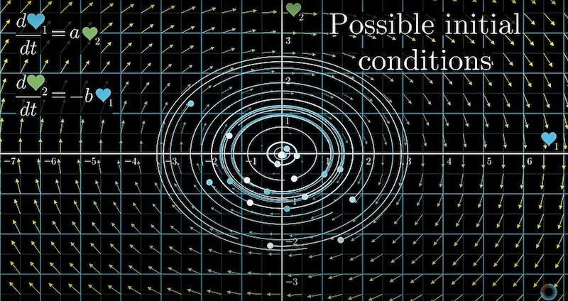
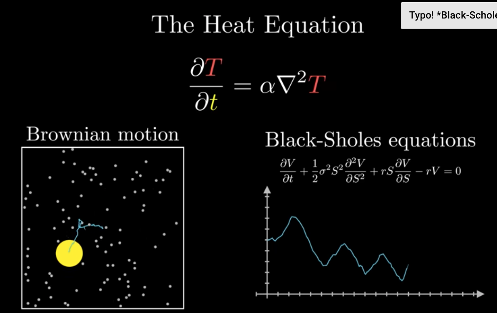

# Differential Equations

## 1 Differential equations, a tourist's guide

**"Since Newtown, mankind has come to realize that the laws of physics are always expressed in the language of differential equations." --- Steven Strogatz**

### 1.1 Introduction

Differential equations araise whenever it's easier to describe change than absolute amounts. It's easier to say why population sizes, for examples, grow or shrink than it is to describe why they have the particular values they do at some point in time.

It may be easier to describe the why you love for someone is changing than why it happens to bewhere it is now.

In physics, more specifically Newtonian mechanics,motion is often describe in terms of force, and force determines acceleration, which is a statement about change.

These equations come in two different flavors:

- Ordinary Different Equations, or ODEs, involving functions with a single input, often thought of as time
- Partial Different Equations, or PDEs, dealing with functions that have multiple inputs.

Partial different equations are something we often think of them as involving a whole continuum of values changing with time, like the temperature at every point of a solid body, or the velocity of a fluid at every point in space.

Ordinary different equations, our involve only a finite collection of values changing with time. And it doesn't have to be time per say, your one indenpent variable could be something elese, but things changing with time are the prototypical and most common example of different equations.

Physics offeres a nice playground for us here, with simple examples to start with, and no shortage of intricacy and nuance as we delve deeper.

Consider the trajectory of something you throw in the air.

The force of gravity near the surface of Earth causes things to accelerate downward at $9.8m/s^{2}$. It means if you look at that object free from other forces, and records its velocity at every second, these velocity vectors will accrue an additional small downward component of $9.8m/s$ everu second, we call this constant 9.8 for gravity.

Focus on the y-coordinate as a function of time, whose derivative in turn gives the vertical component of acceleration.

For compactness, let's write the first derivative as $\dot{y}$ and the second derivative as $\ddot{y}$. Our equation says that $\ddot{y}$ is equal to negatie $g$, a simple constant.

This is one we can solve by integrating, which is essentially working the question backwards. First, to find velocity, what function has negative $g$ as a derivatie? => $-gt$, or more specifically, $-gt + v_{0}$, $v_{0}$ -> the initial velocity.

Notice that there are many functions with this particular derivative, so you have an extra degree of freedom which is determined by an inital condition.

Now what function has this as a derivative? It turns out to be negative one-half g times t squared plush that initial velocity times t, and again we're free to add an additional constant without changing the derivative, and that constant is determined by whatever the inital position is.

There you go, we just solved a different equation, figuring out what a function is based on information about its rate of change.

Things get mmore interesting when the forces acting on a body depend on where that body is. For example, studying the motion of planets, stars, and moons, gravity can no longer be considered a constant. Given two bodies, the pole on one of them is in the direction of the other, with a strength inversely proportional to the square of the distance between them.

As always, the rate of change of position is velocity, but now the rate of change of velocity, acceleration, is some function of position, so you have this dance between two mutually interacting variables, reminiscent of the dance between the two moving bodies which they describe.

### 1.2 Higherorder different equations

This is reflective of the fact that often in differential equations, the puzzles you fae involve finding a function whose derivative and higher order derivatives are defined in terms of the function itself.

In physics it's most common to work with second order differential equations, which means the highest derivatives you find in this expression is a second derivative.

Higher order differential equations would be ones involving third derivatives, forth derivatives, and so on, puzzles with more intricate clues.

The sensation you get when you really meditating on one of these equations is one of solving an infinite continous jigsaw puzzle. In a sense, you have to find infinitely many numbers, one for each point in time t, but they're constrained by a very spcific way that these values intertwine with their own rate of change, and the rate of change of that rate of change.

Let's review the deceptively simple eample, a pendulum. How does this angle $\theta$ that it makes with the vertical change as a function of time?

This is often as an example in introductory physic classes of harmonic motion, meaning it oscillates lke a sine wave. More specifically, one with a period of 2 pi times the square root of L over g, wher L us the length of pendulum and g is the strength of gravity.

However, these formulas are actually **_lies_**, or rathe approximations which only work in the realm of small angles. If you were go and measure an actual pendulum, what you find is that as you pull it out farther, the period is **longer** than what the high school physics formular would suggest.

When you pull it out really far, this value of $\theta$ ploted versus time doesn't even look like a sine wave anymore.

### 1.3 Pendulum different equations

To understand what's really going on, first things first,let's set up the different equation.

We'll measure the position of the pendulum's weight as a distance $x$ along this arc, and if this angle $\theta$ we care about is measured in radians, we can write $x$ as $L\theta$, where $L$ is the length of the pendulum.

As usual, gravity pulls down with an acceleration of $g$, but because the pendulum contrains the motion of this mass, we have to look at the component of this acceleration in the direction of motion.

So the component of gravity in the direction of motion opposite this angle will be $-gsine\theta$.

Here we're considering $\theta$ to be positive when the pendulum is swung to the right, and negative when it's swung to the left. This $-sin$ in the acceleartion indicates that it's always pointed in the opposite direction from displacement.

So what we have is that the second derivative of x, the acceleration $\ddot{x}$, is $-gsine\theta$.

As always, it's nice to do a quick gut check that our formula makes physical sense. When $\theta$ is 0, $sin0 = 0$, so there's no accerleration in the direction of movement.

When $\theta$ is 90 degrees, $sin\theta$ is 1, so the acceleration is the same as it would be for freefall.

And because $x = L\theta$, that means the second derivative of $\theta$ is ${-g\over{L}}sine\theta$

To be a little more realistic, let's add in a term to account for the air resistance, which mayve we model as being proportional to the velocity. We'll write this as $-\mu \dot{\theta}$, where $\mu$ is some constant that encapsulates all the air resistance and friction and such that determines how quickly the pendulum loses energy. This is a particular juicy different equation.

It's not eqsy to solve, but it's not so hard that we can't resonably get some meaningful understanding out of it.

At first glance, you might think that the sine function relates to the sine wave pattern for the pendulum. Ironically, though, what you'll eventually find is that the opposite is true.

The presence of the sine in this equation is precisely why real pendulums don't oscillate with a sine wave pattern. If that sounds odd, consider the fact that here, the sine function is talking $\theta$ as an input, but in the approximate solution you might see in a physics class, $\theta$ itself is oscillating as the output of a sine function.

Clearly something fishy is afoot. One thing I like this example is that, even though it's comparatively simple, it exposes an important truth about differential equation that you need to grapple with. Thet are really freaking hard to solve!

In this case, if we remove that dampening term, we can just barely write down an analytic solution, but' it's hilariously completed. It involves all these functions probably never heard of, written in terms of intergrals and weird inverse integral problems.

When you step back, presumably the reason for fining a solution is to then be able make computations and build an understanding for whatever dynamics you're studying.

In this case, those questions have been punted off to figuring out how to compute, and more importantly, understand, these new functions.

So instead, in the study of differential eequations, we often do a sort of short circuit, and skip the the actual solution part, since it's unattainnable, and go straight to building and making computation from the equation alone.

### 1.4 Visualization

Start by visualizing all possible states in a two-dimensional plane.

By the state of the pendulum, is that you can describe it with two numbers: the angle $\theta$ and the angular velocity $\dot{\theta}$. You can freely change either one of those two values without necessarily changing the other, but the accelearation is purely a function of those two values.

So each point of thi two-dimensional plane fully describes the pendulum at any given moment. You might think of these aas all possible initial conditions of that pendulum. If you know the initial angle and the angular velocity, that's enough to predict how the sytem will evolve as time moves forward.

What you're looking at now, this inward sprial, is a fairly typical trajectory for our pendulum. Notice how at the start, as $\theta$ decreases, $\dot{\theta}$, the y-coordinate, gets more negative.

Which makes sense, because the pendulum moves faster in the leftward direction as it approaches the buttom. Keep in mind, even though the velocity vector on this pendulum is pointed to the left, the velue of that velocity is always being represented by the vertical component of our space.

It's important to remind yourself that this state space is an abstract thing, and is distinct from the physical space where the pendulum itself lives and moves. Since we're modeling this as losing some of its energy to air resistance, this trajectory spirals inward, meaning the peak velocity and peak displacement each go down a bit with each swing. Our point is, in a sense, attracted to the origin, where $\theta$ and $\dot{\theta}$ both equal $0$.

With this space, we can visualize a differential equation as a vector field. The pendulum state is a vector [$\theta$, $\dot{\theta}$]. Maybe you think of that as an arrow from the origin, or maybe you think of it as a point.

What matters is that it has two coordinates, each a function of time. Taking the derivative of that vector gives its rate of change, the direction and speed that it will tend to move in this diagram.

That derivative is a new vector, [$\dot{\theta}$, $\ddot{\theta}$], which we visualize as being attached to the relevant point in space.

The first component for this rate of change vector is $\dot{\theta}$, which is also a coordinate in our space. The higher up we are in the diagram, the more the point tends to move to the right, and the lower we are, the more it tends to move to the left.

The vertical component is $\ddot{\theta}$, which is our differential equation lets us rewrite entirely in terms of $\theta$ and $\dot{\theta}$ itself. in other words, the first derivative of our state vector is some function of that vector itself, with most of the intricacy tied up in that second coordinate.

During the same all points of this space will show how that state ends to change from any position.

How that state tends to change from any position. As is typical with vector field, we artificially scale down the vectors when we draw them to prevent clutter, but use color to loosely indicate magnitude.

Notice we've effectively broken up a single second-order equation into a system of two first-order equations.

We might even give $\dot{\theta}$ a different name, to emphasize that we're really thinking of two separate values, intertwined via mutual effect they have on one another's rate of change. This is a common trick in the study of differential equations.

Instead of thinking about higher order changes of a single value, we often prefer to think ofthe first derivative of vector values.

What exactly some of these trajectory lines say about the possible ways of the pendulum evovles from different starting conditions.

For example, in regions where $\dot{\theta}$ is quite high, the vectors guide the point to travel to the right quite a ways before settling down into an inward sprial. This corresponds to a pendulum with a high enough initial velocity that it fully rotates around several times before setting into a decaying back and forth.

When I tweak this air resistance term, $\mu$, say increasing it, you can immediately see how this will result in trajectories that sprial inward faster, which is to say the pendulum slows down faster.

That's obvious when I call it the air resistance term, but imagine that you saw these equations out of contet, not knowing that they described a pendulum. It's not obvious just looking at them that increasing this value of $\mu$, means the system as a whole tends towards some attracting state faster.

What's wonderful is that any system of ordinary differential equations can be describe by a vector filed like this, so it's a very general way to get a feel them.

Usually, though, they have many more dimensions. For example, consider the famous three-body problem, which is to predict how three masses in three-dimensional space evolve if they act on each other with gravity, and if you know their initial positions and velocities.

### 1.5 Three body problem

Usually, though, they have many more dimensions, each mass has three coordinates describing its position, and three more describing its momentum. So the system has 18 degrees of freedom in total, and hence an 180dimensional space of possible states.

A single point meandering through an 18-dimensional space that we cannot visualize, obediently taking steps through time based on whatever vector it happens to be sitting on from moment to moment, completely encoding the position and the moemta of the three masses we see in ordinary, physical 3D space.

In practice, you can reduce the number of dimensions here by taking advantage of the symmetries of your setup, but the point that more degrees of freedom results in higher dimensional state spaces remains the sane.

### 1.6 Phasespace

In math, we often call a space like this a phase space. We use that term broadly for spaces encoding all kinds of states of changing systems, but you should know that in the context of physics, especially Hamiltonian mechanics, the term is often reserved for a more special case, namely a space whose axes represent position and momentum.

So a physicist would agree that the 18-dimensional space describing the three-body problem is a phase space, but they might ask that we make a couple of modifications to our pendulum setup for it to properly deserve the term.

For those of you who just watched the block collision video, the planes we worked with there would be called phase spaces by math folk, though a physicist might prefer other terminology.

Just know that the specific meaning may depend on your context. It may seem like a simple idea, depending on how well indoctrinated you are to modern ways of thinking about math, but it's worth keeping in mind that it took humanity quite a while to really embrace thinking of dynamics spatially like this, especially when the dimensions get very large.

One reason its powerful is that you can ask questions, not just about a single intial condition but about a whole spectrum of initial states. The collection of all possible trajectories is reminiscent of a moving fluid.

So we call it **phase flow**, to take one example of why phase flow is a fruitful idea, consider the quetion of stability.

The origin of our space corresponds to the pendulum standing still, and so does this point over here, representing when the pendulum is perfectly balanced upright.

These are the so-called **fixed points** of our system, and one natural question to ask is whether or not they're stable, that is, with tiny nudges to the sytem result in a state that tends back towards that fixed points, or away from it?

Physical intuition for the pendulum makes the answer here kind of obvious, but how would you think about stability just looking at the equations, say if they arose in some completely different less intuitive context?

The intuition for the relevant computations are guided heavily by the thought of looking at small regions in space around a fixed point, and asking whether the flow tends to contract or expand.

### 1.7 Love

And speaking of attraction and stability, let's take a brief side-step to talk about love.

**"Since Newton, mankind has come to realize that the laws of physics are always expressed in the language of differential equations. --- Steven Strogatz"**

Imagine you've been flirting with someone, but there's been some furustrating inconsistency to how mutual your affection seems, and perhaps during a momnet when you turn your attention towards physics to keep your mind off the romantic turmoil, mulling over the broken-up pendulum equations, you suddenly understand the on-off-again dynamics.

You've notice that your own affection tends to increase when your companion seems interested in you, but decrease when they seem colder. That is, the rate of change of your love is proportional to their feelings for you.

But this sweetheart of your is precisely the opposite, strangely attracted to you when you seem ininterested, but turned off once you seem too keen.

The phase space for these equations looks very similiar to the center part of your pendulum diagram. The two of you will go back and forth between affection and repulsion in an endless cycle. A metaphor of pendulum swings in your feelings would not just be apt, but mathematically verified.

In fact, if your partner's feelings were further slowed when they feel themselves too in love, let's say out of a fear of being made vulnerable, we'd have a term matching the friction in the pendulum, and you too would be destined to inward spiral towards mutual ambivalence. I hear wedding bells already.

The point is that two very different-seeming laws of dynamics, one from physics, involving a single variable, and another from, chemistry, with two variables, actually have a very similiar structure, easier to recoginize when you're looking at the phase diagram.

Most notably, even though the equations are different, for example there's no sine function in the romance equations, the phase space exposes an underlying similarity nevertheless.

In other words, we're not just studying a pendulum right now, the tactics you develop to study one case have a tendency to transfer to many others.

### 1.8 Computing

One way to do this is to essentially simulate what the universe would do, but using finite steps instead of the infinitesimals and limits defining calculus.

Tha basic idea is that if you are at some point in the phase diagram, take a step based on the vector you're sitting on for a small time step, $\Delta{t}$. Specifically, take a step equal to $\Delta{t}$ times that vector $\Delta{t}\vec{v}$.

As a reminder, in drawing these vector fields, the magnitude for each vector has been artificially scaled down to prevent clutter.

When you do this repeatly, you final location will be an approximation of $\Delta{t}$, where $t$ is the sum of all those time steps. Now it's inaccurate because the time steps $\Delta{t}$ of $0.5$ is way too big.

If we turned it down, say to 0.01, you can get a much more accurate approximation, it just takes more repeated steps is all. In this case, computing $\Delta$ of $10$ requires 1000 little steps.

Luckily, we live in a world with computers, so repeating a simple task 1000 is as simple as articulating that task with a programming language.

## 2 But what is a partial differential equation?

### 2.1 Introduction

We turn now to an example of a partial different equation, the heat equation. To set things up, imagine you have some object, like a piece of metal, and you know how the heat is distributed across it at any one moment, that is, what's the temperature of every individual point along this plate.

The question is, how ill this distribution change over time, as the heat flows from warmer spots to cooler ones?

The image on the left shows the temperature of an example plate using color, with the graph of that temperature being shown on the right.

To take a concrete one-dimensional example, let's say you have two different rods at different temperatures, where the temperature is uniform along each one.

WHen you bring them into contct, the temperature will flow from the hot one to the cool one, tending to make the whole thing equal over time. But how exactly?

As is typical with different equations, the idea is that it's easier to describe how this setup changes from moment to moment, than it is to jump straight to a description of the full evolution.

We write this rule change in the language of derivatives, though as you'll see, we'll need to expand our vocabulary a bit beyond ordinary deivatives.

Variations of the heat equation show up in many other parts of math and physics, like Brownian motion, the black-Scholes equation from finance, and all sorts of diffusion, so there are many dividends to be had from a deep undertanding of this one setup.

In previous we looked at ways of building understanding while acknowledging the truth that most differential equations are simply too difficult to actually solve.

And indeed, PDEs tend to be even harder than ODEs, largely because they involve modeling infinitely many values changing in concert.

But our main character for tody is an equation we can actually solve.

### 2.2 Partial derivatives

Step one is simply to build up the heat equation, and for that, let's start by being clear about what the function we're analyzing is exactly. We have a rod in one dimension, and we're thinking of it as sitting on an x-axis, so each point of that rod is labeled with a unique number, $x$.

The temperature is some function of that position, $T(x)$.

But really, since the value changes over time, we should think of this function as having one more input, $t$, for time. You could, if you want, think of this input space as being two-dimensional, representing space and time together, with the temperature being graphed as a surface above it, each slice across time, showing you what the distribution looks like at any given moment.

Or you could simply think of this graph of temperature changing with time. Both are equivalent.

This surface is not to be confused with the temperature graph of a two-dimensional body.

Be mindful when you're studying equations like these of whether time is being represented with its own axis, or if it's being represented with literal changes over time.

Last chapter, we looked at some systems where just a handful of numbers changed over time, like the angle and angular velocity of a pendulum, describing that chnage in the language of derivatives.

But when we have an entire function changing with time, the mathematical tools become slightly more intricate. Because we are thinking of this temperature function with multiple dimensions to its input space, in this case one for space and one for time, there are multiple different rates of change at play.

There's the derivative with respect to $x$, how rapidly the temperature changes as you move aling the rod. You might think of this as the slope of our surface when you slice it parallel to the x-axis, or givin a tiny step in the x-direction and the tiny change to temperature caused by it, giving a ratio between the two.

But there's also the rate at which a single point to the rod changes with time, what you might think of as the slope of the surface when you slice it in the other direction, parallel to the time axis.

Each one of these derivatives tells only part of the story for how this temperature function changes, **so we call them partial derivatives**. To emphasize this point, the notation changes a little, replacing the letter $d$ with a speicial curly D $\partial$.

I'd rather see notation that emphasizes that the $\parallel{T}$ terms up in the numerators refer to different changes, one is a small change to temperature after a small change.

The other is a small change to temperature after a small step in space.

### 2.3 Building the heat equation

The heat equation is written in terms of these partial derivatives. It tells us that the way this function changes with respect to time depends on how it changes with respect to space. More specifically, it's proportional to the second partial derivative with respect to $x$.

At a high level, the intuition is that at points where the temperature distribution curves, it tends to change more quickly in the direction of that curvature. Since a rule like this is written using partial derivatives, we call it a partial different equation.

Thinking of this equation, where does it come from? For that let's simplify by describing a discrete version of the setup, wheere you have only finitely many points $x$ in a row. This is sort of like working in a pixelated universe where instead of having a continuum of temperatures, we have a finite set of separate values.

The intuision here is for a particular point, if its two neighbors on either side are on average hotter than it is, it will heat up.

It they're cooler on averge, it'll cool down.

Here, specifically focus on these three neighboring points $x1$, $x2$, and $x3$, with corresponding temperature $T1$, $T2$, and $T3$. What we want to compare is the average of $T1$ and $T3$ with the value of $T2$. When this difference is greater than zero, $T2$ will tend to heat up. And the bigger the difference, the faster it heats up.

Likewise, if it's negative, $T2$ will tend to cool down at a rate proportional to that difference.

More formally, we write that the derivative of $T2$ with respect to time is proportional to the difference between its neighbors and its own value. $\alpha$ here is simply a proportionality constant.

Two write this in a way which will ultimately explain the second derivative in the heat equation, let me rearrange this right hand a bit in terms of the difference between $T1$ and $T2$, and the difference between $T2$ and $T3$. You can quickly to check that are the same.

The reason we rewrite it takes us a step closer to the language of derivatives.

Instead of comparing the average of the neighbors to $T2$, we're thinking about the difference of the differeces. If those two differences are the same (the difference is 0), then the average of $T1$ and $T2$ is the same as $T2$, so $T2$ will not tend to change.

If $\Delta{T2}$ is bigger than $\Delta{T1}$, meaning the difference of the difference is positive, notice how the average of $T1$ and $T3$ is bigger than $T2$, so $T2$ tends to increase.

On the flip side, if the difference of the difference is negative, which means $\Delta{T2}$ is smaller than $\Delta{T1}$, it cooresponds to an average of these neighbors being less than $T2$.

We could be especially compact with our notation and write this whole term the difference between the differences, as $\Delta{\Delta{T1}}$. This is known in the lingo as a second difference.

Just keep in mind, it is just essentially a compact way of writing the idea of how much $T2$ differs from the average of its neighbors. It just has this extra factor of one half, is all. And that factor doesn't really matter, because either way we're writing this equation in terms of some proportionality constant.

The upshot is that the rate of change for the temperature of a point is proportional to the second difference around it. As we go from this finite context to the infinite continuous case, the analog of a second difference is the second derivative.

Instead of looking at the difference between the temperature value at points some fixed distance apart, you instead consider what happens as you shrink the size of that step towards zero.

And in calculus, instead of talking about absolute differences, which would also approach zero, you think in terms of the rate of change. In this case, what's the rate of change in temperature per unit distance?

And remember, there are two separate rates of change at play. How does that temperature change as time progresses, and how does the temperature change as you move along the rod?

The core intuition remains the same as what we had in the discrete case. To know how a point differs from its neghbors, look not just at how the function changes from one point to the next, but at how the rate of change itself chanegs.

Now in calculus land, we write this as del-sqaured t over del x-square $\partial^{2}{T} \over{\partial{x^{2}}}$.

Notice how this slope increase at points where the graph curves upwards, meaming the rate of chnage of the rate of cange is positive. Similarly, that slop decreases at points where the graph curves downwards, where the rate of the change of this rate of change is negative.

Tuck that away as a meaningful intuition for problems well beyond the heat equation. Second derivativs give a measure of how a value compares to the average of its neighbors.

### 2.4 ODEs vs PDEs

Take a moment to compare what this feels like to the case of ordinary differential equations. For example, if have multiple bodies in space tugging at each other with gravity, what we're analyzing is a handfuf of changing numbers, in this case the coordinats of each object. The rate of change for any one of these values depends on the values of the other numbers, and we often write this down as a system of equations.

On the left, we have the derivative of each value with respect to time, and on the right there is some combination of all the other values.

In our partial differential equation, the difference is that we have infinitely many values changing from a continuum, and again, the way that any one of these values changes depends on the other values, but quite helpful, each one only depends on its immediate neighbors in some limiting sense of the word "neighbor".

So here, ther relation on the right hand side is not a sum or product ot the other numbers, it's instead a kind of derivative, just a derivative with respect to space instead of with respect to time. In a sense, when you think about it, this one partial differential equation is like a system of infinitely many equations, one for each point on the rod.

### 2.5 The laplacian

You might wonder about objects which are spread out in more than one dimension, like a plate, or something three dimensional. In that case the equation looks quite smililar, but you include the second derivative with respect to the other spatial directions as well.

And adding up all of these second spatial derivatives like this is common enough as an operation that it has it own special name, the **Laplaceian**, often written as this upside down triangle squared.

It's essentially a multivariable version of the second derivative, and the intuition for this equation is no different from the one dimensional case. This Laplacian can still be thought of as measuring how different is a point from the average of its neighbors, but now these neighbors aren't just left and right of it, they're all around.

### 2.6 Book recomemdation

### 2.7 it should read "scratch an itch"

1. Scratch and itch
   

2. Make people love math

## 3 Solving the heat equation

### 3.1 Three conditions

Actually, it's a little misleading to refer to all of this as solving an equation. The PDE itself only describes one out of three constraints that our temperature function must satifsy if it's going to accurately describe heat flow.

It must also satisfy certain boundary conditions, which is something we'll talk about mementarily, and a certain initial condition, that is, you don't get to choose how it looks at time $t=0$.

These added constrains are really where all of the challenge lies. There is a vast ocean of functions solving the PDE, in the sense that when you take their partial derivatives the thing is going to be equal, and a sizable subset of that ocean satisfies the right boundary conditions.

When Joseph Fourier solved this problem in 1822, his key contribution was to gain control of this ocean, turning all of the right knobs and dials, so as to be able to select from it the particular solution fitting a given initial condition.

We can think of this solution as being broken down into three fundamental observations.

1. Certain sine waves offer a really simple solution to this equation.
2. If you konw multiple solutions, the sum of these functions is also a solution.
3. Most surprisingly, any function can be expressed as a sum of sine waves.
   - A pedantic mathematician might point out that there are some pathological exceptions.
   - But basically any distribution you would come across in practice, including discontinuous ones, can be written as a sum of sine waves, potentially infinitely many.
   - Fourier series.

If so, maybe you've wondered, why on earth would anyone care about breaking down a function as a sum of sine waves?

Well, in many applications, sine waves are nicer to deal with than anything else, and differential equations offer us a really nice context where you can see how that places out.

For our heat equation, when you write a function as a sume of these waves, the relatively clean second derivatives make it easy to solve heat equation for each one of them, and as you'll see, a sum of solutions to this equation gives us another solution, and so in turn that will give us a recipe for solveing the heat equation for any complicated distribution as an initial state.

### 3.2 Why is sine wave?

Here, let's dig into that first step, why exactly would sine waves play nicely with the heat equation?

To avoid messy constants, let's start simple and say that the temperature function at $t=0$ is simpy $sin(x)$, where $x$ describes the point on the rod.

Yes, the idea of a rod's temperature just happening to look like $sine(x)$, varying around whatever temperature our conventions arbitrarily lable as 0 is clearly absurd, but in math you should always be happy to play with examples that are idealized, potentially well beyond the point being realistic, because they can offer a good first tep in the direction of something more general, and hence more realistic.

The right-hand side of this heat equation asks about the second derivative of our function, how much our temperature distribution curves as you move along space. The derivative of $sin(x)$ is $cos(x)$, whose derivative in turn is negative $sin(x)$.

The amount of the wave curves is, in a sense, equal and opposite to its hight at each point. So at least at $t=0$, this has the peculiar effect that each point changes its temperature at a rate proportional to the temperature of the point itself, with the same proportionality constant across all points.

So after some tiny time step, everything scales down by the same factor, and after that, it's still the same sine curve shape, just scaled down a bit, so the same logic applies, and the next time step would scale it down uniformly again.

This applies just as well in the limit, as the size of these time steps approaches 0. So unlike othe temperature distribution, sine waves are peculiar in that they will get scaled down unitformly, looking like some constant times sine of x for all times t.

Now when you see that the rate at which some value changes is proportional to that value itself, your mind should burn with the thought of an exponential. And if it's not, or if you're a little rusty on the idea of taking derivaives of exponentials, or what makes the number $e$ special.

The upshot is that the derivative of $e$ to some constant times $t$ is equal to that constant times itself. If the rate at which your investment grows, for example, if the rate is always 0.05 times the total value, then its value over time is going to look like $e^{0.5t}$ times the initial investment was.

If the rate at which the count of carbon-14 atoms in an old bold changes is always equal some negative constant times that count itself, than over time that number will look approximately like $e^{-kt}$ times whatever the inital count was.

### 3.3 Continoue to slove the heat equation

So when you look at our heat equation, and you know that for a sine wave, the right hand side is going to be negative alpha times the temperature function itself $-\alpha{T}$, hopefully it won't be too surprising to propose that the solution is to scale down by a factor of $e$ to the $-\alpha{T}$.

Here, go ahead and check the partial derivatives. The proposed functon of x and t $T(x, t)$ is $sin(x)e^{-\alpha{t}}$. Taking the second partial derivative with respect to $x$, that $e$ to the $-\alpha{t}$ term looks like a constant, it doesn't have any $x$ in it.

So it just comes along for the right, as if it was any other constant, like 2, and the first derivative with respect to $x$ is $cos(x)e^{-\alpha{t}}$. Likewise, the second partial derivative with respect to $x$, becomes $-sin(x)e^{-\alpha{t}}$.

And on the flip side, if you look at the partial derivative with respect to $t$, that $-sin(x)e^{-\alpha{t}}$ term now looks like a constant, since it doesn't have a $t$ in it. So we get $-\alpha{sin(x)e^{-\alpha{t}}}$.

So indeed, this function does make the partial differential equation true.

### 3.4 Is it that simple?

if it was only that simple, this narrative flow could be so nice, we would just beeline directly to the delicious Fourier series conclusion.

Sadly, nature is not so nice, knocking us off onto an annoying but highly necessary detour.

Here is the thing, even if nature were to somehow produce a temperature distribution on this rod, which looks like this perfect sine wave, the exponential decay is not actually how it would evolve.

Assuming that no heat flows in or out of the rod, here's what that evolution would actually look like.

In fact, let me give you an even simpler solution to the PDE which fails to describe actual heat flow, a straight line, that is, the temperature function will be some non-zero constant times x, and never change over time.

The second partial derivative with respect to $x$ is indeed 0, I mean there is no curvature, and its partial derivative with respect to time is also 0, since it never changes over time.

And yet, if I throw this into the simulator, it does actually change over time, slowly approaching a uniform temperature at the mean value. What's going on here is that the simulation I'm using treats the two boundary points of the rod differently from how it treats all the others. which is a more accurate reflection of what would actually happen in nature.

### 3.5 The boundary condition

But at the boundary, there is no neighbor at one side. If we went back to thinking of the discrete version, modeling only finitely many points on this rod, you could have each boundary point tend towards its one neighbor at a rate proportional to their difference.

As we do this for higher and higher resolutions, notice how pretty much immediately after the clock starts, our distribution looks flat at either of those two boundary points.

In fact, in the limiting case, as these finer and finer discretized setups approach a continuous curve.

The slope of our curve at the bounday will be zero for all fimes after the start.

One way this is often described is that the slope at any point is proportional to the rate of heat flow at that point.

So if you want to model the restriction that no heat flows into or out of the rod, the slope at either end will be zero.

In other words, finding a function satisfying the heat equation itelf iss not enough. It must also satisfy the property that it's flat at each of those endpoints for all times greater than zero.

Phrase more precisely, the partial derivative with respect to $x$ of our temperature function at $(0, T)$ and at $(L, T)$ must be $0$ for all times $T > 0$, where $L$ is the length of the rod.

This is an example of a boundary condition, and pretty much any time you have to solve a partial differential equation in practice, there will also be some boundary condition hanging along for the ride, which demands just as much attention as the PDE itself.

### 3.6 What we've got

All of this may make it feel like we've gotten nowhere, but the function which is a sine wave in space and an exponential decay in time, actually gets us quite close, we just need to tweak it a little bit so that it's flat at both endpoints.

First of all, notice that we could just as well use a cosie function instead of a sine. It's the same wave, it's just shifted in phase by a quarter of the period, which would make it flat at $x = 0$, as we want.

The second derivative of $cos(x)$ is also negative one times itself, so for all the same reasons as before, the product $cos(x)e^{-\alpha{t}}$ still satisfies the PDE.

To make sure that it also satisfies the boundary condition on that right side, we're going to adjust the frequency of the wave. However, that will affect the second derivative, since higher frequency waves curve more sharply.

And lower frequency ones curve more gently.

Changing the frequency means introducing some constant, say $\omega$, multiplied by the input of this function. A higher value of $\omega$ means the wave oscillate more quickly, since as you increase x, the input to the cosine increases more rapidly.

Taking the derivative with respect to $x$, we still get negative sine, but the chain rule tells us to multiply that $\omega$ on the outside, and similarly the second derivative will still be negative cosine, but now with $\omega^{2}$.

This means that the right hand side of our equation has now picked up this $\omega^{2}$ term. So the balance things out, on the left hand side, the exponential decay part should have an additional $\omega^{2}$ term up top.

Unpacking what that actually means should feel intuitive. For a temperature function filled with sharper curves, it decays more quickly towards an equilibrium, and evidently does this quadratially.

It decays more quickly towards an equilibrium, and evidently does this quadratically. For instance, doubling the frequency results in an exponential decay four time as fast.

