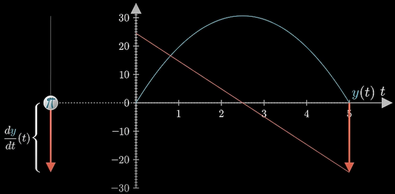
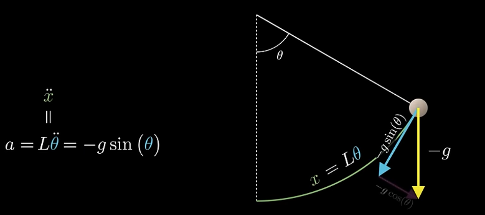
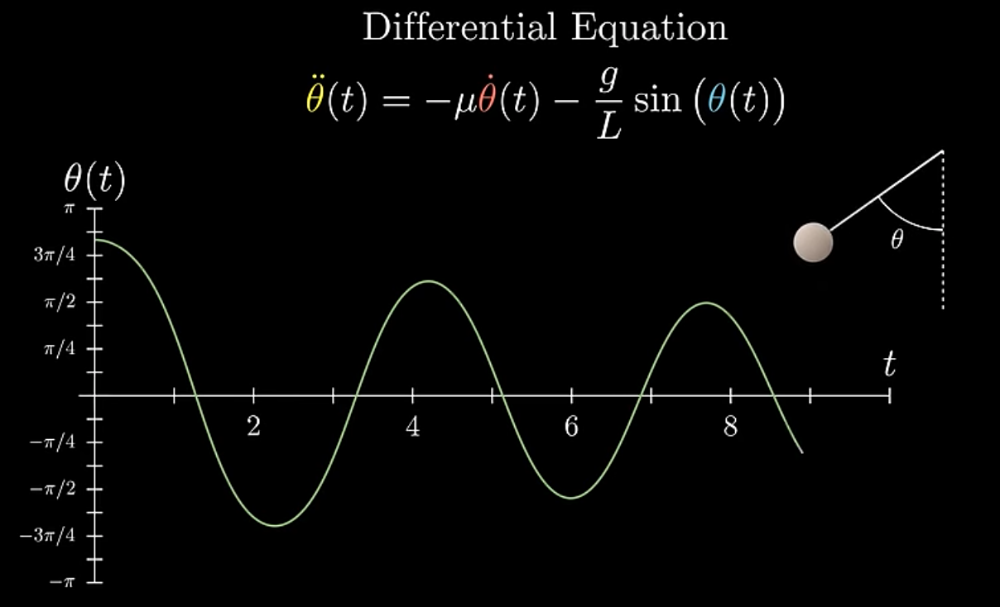
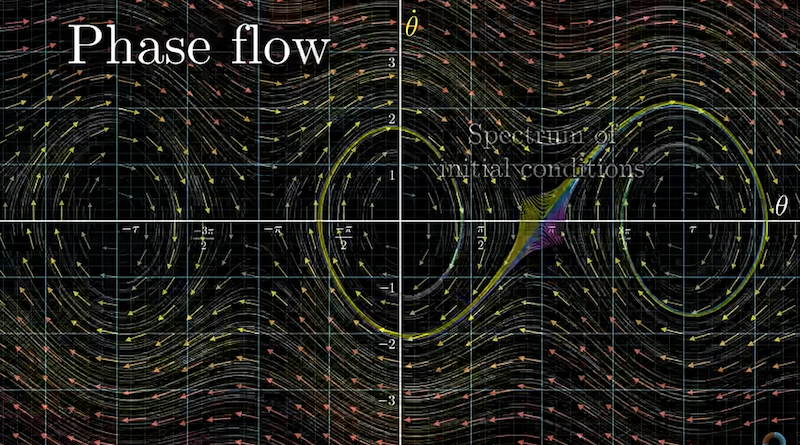

# Differential Equations

## 1 Differential equations, a tourist's guide

**"Since Newtown, mankind has come to realize that the laws of physics are always expressed in the language of differential equations." --- Steven Strogatz**

### 1.1 Introduction

Differential equations araise whenever it's easier to describe change than absolute amounts. It's easier to say why population sizes, for examples, grow or shrink than it is to describe why they have the particular values they do at some point in time.

It may be easier to describe the why you love for someone is changing than why it happens to bewhere it is now.

In physics, more specifically Newtonian mechanics,motion is often describe in terms of force, and force determines acceleration, which is a statement about change.

These equations come in two different flavors:

- Ordinary Different Equations, or ODEs, involving functions with a single input, often thought of as time
- Partial Different Equations, or PDEs, dealing with functions that have multiple inputs.

Partial different equations are something we often think of them as involving a whole continuum of values changing with time, like the temperature at every point of a solid body, or the velocity of a fluid at every point in space.

Ordinary different equations, our involve only a finite collection of values changing with time. And it doesn't have to be time per say, your one indenpent variable could be something elese, but things changing with time are the prototypical and most common example of different equations.

Physics offeres a nice playground for us here, with simple examples to start with, and no shortage of intricacy and nuance as we delve deeper.

Consider the trajectory of something you throw in the air.

The force of gravity near the surface of Earth causes things to accelerate downward at $9.8m/s^{2}$. It means if you look at that object free from other forces, and records its velocity at every second, these velocity vectors will accrue an additional small downward component of $9.8m/s$ everu second, we call this constant 9.8 for gravity.

Focus on the y-coordinate as a function of time, whose derivative in turn gives the vertical component of acceleration.

For compactness, let's write the first derivative as $\dot{y}$ and the second derivative as $\ddot{y}$. Our equation says that $\ddot{y}$ is equal to negatie $g$, a simple constant.

This is one we can solve by integrating, which is essentially working the question backwards. First, to find velocity, what function has negative $g$ as a derivatie? => $-gt$, or more specifically, $-gt + v_{0}$, $v_{0}$ -> the initial velocity.

Notice that there are many functions with this particular derivative, so you have an extra degree of freedom which is determined by an inital condition.

Now what function has this as a derivative? It turns out to be negative one-half g times t squared plush that initial velocity times t, and again we're free to add an additional constant without changing the derivative, and that constant is determined by whatever the inital position is.

There you go, we just solved a different equation, figuring out what a function is based on information about its rate of change.

Things get mmore interesting when the forces acting on a body depend on where that body is. For example, studying the motion of planets, stars, and moons, gravity can no longer be considered a constant. Given two bodies, the pole on one of them is in the direction of the other, with a strength inversely proportional to the square of the distance between them.

As always, the rate of change of position is velocity, but now the rate of change of velocity, acceleration, is some function of position, so you have this dance between two mutually interacting variables, reminiscent of the dance between the two moving bodies which they describe.

### 1.2 Higherorder different equations

This is reflective of the fact that often in differential equations, the puzzles you fae involve finding a function whose derivative and higher order derivatives are defined in terms of the function itself.

In physics it's most common to work with second order differential equations, which means the highest derivatives you find in this expression is a second derivative.

Higher order differential equations would be ones involving third derivatives, forth derivatives, and so on, puzzles with more intricate clues.

The sensation you get when you really meditating on one of these equations is one of solving an infinite continous jigsaw puzzle. In a sense, you have to find infinitely many numbers, one for each point in time t, but they're constrained by a very spcific way that these values intertwine with their own rate of change, and the rate of change of that rate of change.

Let's review the deceptively simple eample, a pendulum. How does this angle $\theta$ that it makes with the vertical change as a function of time?

This is often as an example in introductory physic classes of harmonic motion, meaning it oscillates lke a sine wave. More specifically, one with a period of 2 pi times the square root of L over g, wher L us the length of pendulum and g is the strength of gravity.

However, these formulas are actually **_lies_**, or rathe approximations which only work in the realm of small angles. If you were go and measure an actual pendulum, what you find is that as you pull it out farther, the period is **longer** than what the high school physics formular would suggest.

When you pull it out really far, this value of $\theta$ ploted versus time doesn't even look like a sine wave anymore.

### 1.3 Pendulum different equations

To understand what's really going on, first things first,let's set up the different equation.

We'll measure the position of the pendulum's weight as a distance $x$ along this arc, and if this angle $\theta$ we care about is measured in radians, we can write $x$ as $L\theta$, where $L$ is the length of the pendulum.

As usual, gravity pulls down with an acceleration of $g$, but because the pendulum contrains the motion of this mass, we have to look at the component of this acceleration in the direction of motion.

So the component of gravity in the direction of motion opposite this angle will be $-gsine\theta$.

Here we're considering $\theta$ to be positive when the pendulum is swung to the right, and negative when it's swung to the left. This $-sin$ in the acceleartion indicates that it's always pointed in the opposite direction from displacement.

So what we have is that the second derivative of x, the acceleration $\ddot{x}$, is $-gsine\theta$.

As always, it's nice to do a quick gut check that our formula makes physical sense. When $\theta$ is 0, $sin0 = 0$, so there's no accerleration in the direction of movement.

When $\theta$ is 90 degrees, $sin\theta$ is 1, so the acceleration is the same as it would be for freefall.

And because $x = L\theta$, that means the second derivative of $\theta$ is ${-g\over{L}}sine\theta$

To be a little more realistic, let's add in a term to account for the air resistance, which mayve we model as being proportional to the velocity. We'll write this as $-\mu \dot{\theta}$, where $\mu$ is some constant that encapsulates all the air resistance and friction and such that determines how quickly the pendulum loses energy. This is a particular juicy different equation.

It's not eqsy to solve, but it's not so hard that we can't resonably get some meaningful understanding out of it.

At first glance, you might think that the sine function relates to the sine wave pattern for the pendulum. Ironically, though, what you'll eventually find is that the opposite is true.

The presence of the sine in this equation is precisely why real pendulums don't oscillate with a sine wave pattern. If that sounds odd, consider the fact that here, the sine function is talking $\theta$ as an input, but in the approximate solution you might see in a physics class, $\theta$ itself is oscillating as the output of a sine function.

Clearly something fishy is afoot. One thing I like this example is that, even though it's comparatively simple, it exposes an important truth about differential equation that you need to grapple with. Thet are really freaking hard to solve!

In this case, if we remove that dampening term, we can just barely write down an analytic solution, but' it's hilariously completed. It involves all these functions probably never heard of, written in terms of intergrals and weird inverse integral problems.

When you step back, presumably the reason for fining a solution is to then be able make computations and build an understanding for whatever dynamics you're studying.

In this case, those questions have been punted off to figuring out how to compute, and more importantly, understand, these new functions.

So instead, in the study of differential eequations, we often do a sort of short circuit, and skip the the actual solution part, since it's unattainnable, and go straight to building and making computation from the equation alone.

### 1.4 Visualization

Start by visualizing all possible states in a two-dimensional plane.

By the state of the pendulum, is that you can describe it with two numbers: the angle $\theta$ and the angular velocity $\dot{\theta}$. You can freely change either one of those two values without necessarily changing the other, but the accelearation is purely a function of those two values.

So each point of thi two-dimensional plane fully describes the pendulum at any given moment. You might think of these aas all possible initial conditions of that pendulum. If you know the initial angle and the angular velocity, that's enough to predict how the sytem will evolve as time moves forward.

What you're looking at now, this inward sprial, is a fairly typical trajectory for our pendulum. Notice how at the start, as $\theta$ decreases, $\dot{\theta}$, the y-coordinate, gets more negative.

Which makes sense, because the pendulum moves faster in the leftward direction as it approaches the buttom. Keep in mind, even though the velocity vector on this pendulum is pointed to the left, the velue of that velocity is always being represented by the vertical component of our space.

It's important to remind yourself that this state space is an abstract thing, and is distinct from the physical space where the pendulum itself lives and moves. Since we're modeling this as losing some of its energy to air resistance, this trajectory spirals inward, meaning the peak velocity and peak displacement each go down a bit with each swing. Our point is, in a sense, attracted to the origin, where $\theta$ and $\dot{\theta}$ both equal $0$.

With this space, we can visualize a differential equation as a vector field. The pendulum state is a vector [$\theta$, $\dot{\theta}$]. Maybe you think of that as an arrow from the origin, or maybe you think of it as a point.

What matters is that it has two coordinates, each a function of time. Taking the derivative of that vector gives its rate of change, the direction and speed that it will tend to move in this diagram.

That derivative is a new vector, [$\dot{\theta}$, $\ddot{\theta}$], which we visualize as being attached to the relevant point in space.

The first component for this rate of change vector is $\dot{\theta}$, which is also a coordinate in our space. The higher up we are in the diagram, the more the point tends to move to the right, and the lower we are, the more it tends to move to the left.

The vertical component is $\ddot{\theta}$, which is our differential equation lets us rewrite entirely in terms of $\theta$ and $\dot{\theta}$ itself. in other words, the first derivative of our state vector is some function of that vector itself, with most of the intricacy tied up in that second coordinate.

During the same all points of this space will show how that state ends to change from any position.

How that state tends to change from any position. As is typical with vector field, we artificially scale down the vectors when we draw them to prevent clutter, but use color to loosely indicate magnitude.

Notice we've effectively broken up a single second-order equation into a system of two first-order equations.

We might even give $\dot{\theta}$ a different name, to emphasize that we're really thinking of two separate values, intertwined via mutual effect they have on one another's rate of change. This is a common trick in the study of differential equations.

Instead of thinking about higher order changes of a single value, we often prefer to think ofthe first derivative of vector values.

What exactly some of these trajectory lines say about the possible ways of the pendulum evovles from different starting conditions.

For example, in regions where $\dot{\theta}$ is quite high, the vectors guide the point to travel to the right quite a ways before settling down into an inward sprial. This corresponds to a pendulum with a high enough initial velocity that it fully rotates around several times before setting into a decaying back and forth.

When I tweak this air resistance term, $\mu$, say increasing it, you can immediately see how this will result in trajectories that sprial inward faster, which is to say the pendulum slows down faster.

That's obvious when I call it the air resistance term, but imagine that you saw these equations out of contet, not knowing that they described a pendulum. It's not obvious just looking at them that increasing this value of $\mu$, means the system as a whole tends towards some attracting state faster.

What's wonderful is that any system of ordinary differential equations can be describe by a vector filed like this, so it's a very general way to get a feel them.

Usually, though, they have many more dimensions. For example, consider the famous three-body problem, which is to predict how three masses in three-dimensional space evolve if they act on each other with gravity, and if you know their initial positions and velocities.

### 1.5 Three body problem

Usually, though, they have many more dimensions, each mass has three coordinates describing its position, and three more describing its momentum. So the system has 18 degrees of freedom in total, and hence an 180dimensional space of possible states.

A single point meandering through an 18-dimensional space that we cannot visualize, obediently taking steps through time based on whatever vector it happens to be sitting on from moment to moment, completely encoding the position and the moemta of the three masses we see in ordinary, physical 3D space.

In practice, you can reduce the number of dimensions here by taking advantage of the symmetries of your setup, but the point that more degrees of freedom results in higher dimensional state spaces remains the sane.

### 1.6 Phasespace

In math, we often call a space like this a phase space. We use that term broadly for spaces encoding all kinds of states of changing systems, but you should know that in the context of physics, especially Hamiltonian mechanics, the term is often reserved for a more special case, namely a space whose axes represent position and momentum.

So a physicist would agree that the 18-dimensional space describing the three-body problem is a phase space, but they might ask that we make a couple of modifications to our pendulum setup for it to properly deserve the term.

For those of you who just watched the block collision video, the planes we worked with there would be called phase spaces by math folk, though a physicist might prefer other terminology.

Just know that the specific meaning may depend on your context. It may seem like a simple idea, depending on how well indoctrinated you are to modern ways of thinking about math, but it's worth keeping in mind that it took humanity quite a while to really embrace thinking of dynamics spatially like this, especially when the dimensions get very large.

One reason its powerful is that you can ask questions, not just about a single intial condition but about a whole spectrum of initial states. The collection of all possible trajectories is reminiscent of a moving fluid.

So we call it **phase flow**, to take one example of why phase flow is a fruitful idea, consider the quetion of stability.

The origin of our space corresponds to the pendulum standing still, and so does this point over here, representing when the pendulum is perfectly balanced upright.

These are the so-called **fixed points** of our system, and one natural question to ask is whether or not they're stable, that is, with tiny nudges to the sytem result in a state that tends back towards that fixed points, or away from it?

Physical intuition for the pendulum makes the answer here kind of obvious, but how would you think about stability just looking at the equations, say if they arose in some completely different less intuitive context?

The intuition for the relevant computations are guided heavily by the thought of looking at small regions in space around a fixed point, and asking whether the flow tends to contract or expand.

### 1.7 Love

And speaking of attraction and stability, let's take a brief side-step to talk about love.

**"Since Newton, mankind has come to realize that the laws of physics are always expressed in the language of differential equations. --- Steven Strogatz"**

Imagine you've been flirting with someone, but there's been some furustrating inconsistency to how mutual your affection seems, and perhaps during a momnet when you turn your attention towards physics to keep your mind off the romantic turmoil, mulling over the broken-up pendulum equations, you suddenly understand the on-off-again dynamics.

You've notice that your own affection tends to increase when your companion seems interested in you, but decrease when they seem colder. That is, the rate of change of your love is proportional to their feelings for you.

But this sweetheart of your is precisely the opposite, strangely attracted to you when you seem ininterested, but turned off once you seem too keen.

The phase space for these equations looks very similiar to the center part of your pendulum diagram. The two of you will go back and forth between affection and repulsion in an endless cycle. A metaphor of pendulum swings in your feelings would not just be apt, but mathematically verified.

In fact, if your partner's feelings were further slowed when they feel themselves too in love, let's say out of a fear of being made vulnerable, we'd have a term matching the friction in the pendulum, and you too would be destined to inward spiral towards mutual ambivalence. I hear wedding bells already.

The point is that two very different-seeming laws of dynamics, one from physics, involving a single variable, and another from, chemistry, with two variables, actually have a very similiar structure, easier to recoginize when you're looking at the phase diagram.

Most notably, even though the equations are different, for example there's no sine function in the romance equations, the phase space exposes an underlying similarity nevertheless.

In other words, we're not just studying a pendulum right now, the tactics you develop to study one case have a tendency to transfer to many others.

### 1.8 Computing

One way to do this is to essentially simulate what the universe would do, but using finite steps instead of the infinitesimals and limits defining calculus.

Tha basic idea is that if you are at some point in the phase diagram, take a step based on the vector you're sitting on for a small time step, $\Delta{t}$. Specifically, take a step equal to $\Delta{t}$ times that vector $\Delta{t}\vec{v}$.

As a reminder, in drawing these vector fields, the magnitude for each vector has been artificially scaled down to prevent clutter.

When you do this repeatly, you final location will be an approximation of $\Delta{t}$, where $t$ is the sum of all those time steps. Now it's inaccurate because the time steps $\Delta{t}$ of $0.5$ is way too big.

If we turned it down, say to 0.01, you can get a much more accurate approximation, it just takes more repeated steps is all. In this case, computing $\Delta$ of $10$ requires 1000 little steps.

Luckily, we live in a world with computers, so repeating a simple task 1000 is as simple as articulating that task with a programming language.
